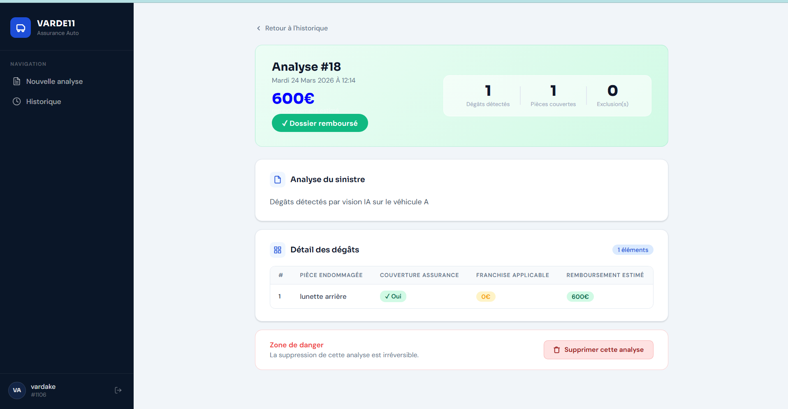

# VARDE11 — Analyse automatisée de sinistres automobile par IA


> Uploade une photo du véhicule endommagé et le constat amiable. L'IA détecte les dégâts, lit le manuscrit et rend une décision d'indemnisation en quelques secondes.

🔗 **Démo live** : [varde11-assurance-frontend.hf.space](https://varde11-assurance-frontend.hf.space)

---

## Contexte

L'analyse d'un dossier sinistre implique de croiser plusieurs sources d'information : dégâts visuels sur le véhicule, déclarations manuscrites du constat amiable, et conditions générales du contrat d'assurance. Ce projet automatise ce processus via un pipeline IA en 3 étapes.

---

## Pipeline 

Ce projet suit un flux de traitement en plusieurs étapes qui combine vision, NLP et règles métier :


## Pipeline IA
```
┌──────────────────┐     ┌──────────────────┐
│  Photo véhicule  │     │  Photo constat   │
└────────┬─────────┘     └────────┬─────────┘
         │                        │
         ▼                        ▼
┌──────────────────┐     ┌──────────────────┐
│     YOLO v8      │     │  Llama 4 Vision  │
│ Détection dégâts │     │ Lecture manuscrit│
└────────┬─────────┘     └────────┬─────────┘
         │                        │
         └───────────┬────────────┘
                     │
                     ▼
          ┌──────────────────────┐
          │   Extraction regex   │
          │  Articles pertinents │
          │  des conditions      │
          │  générales           │
          └──────────┬───────────┘
                     │
                     ▼
          ┌──────────────────────┐
          │    Llama 3.3-70b     │
          │   Décision finale    │
          └──────────┬───────────┘
                     │
                     ▼
          ┌──────────────────────┐
          │  Remboursé / Non     │
          │  remboursé +         │
          │  montant estimé      │
          └──────────────────────┘
                     |
                     |
                     ▼
          Stockage des résultat dans la base de données
```


1. **Photo du véhicule** : YOLO v8 détecte les dégâts visibles sur le véhicule.
2. **Photo du constat** : Llama 4 Vision lit et convertit le texte manuscrit du constat amiable.
3. **Conditions générales** : le contrat est analysé par extraction regex pour isoler les articles pertinents.
4. **LLM Decision** : le modèle de décision combine les informations des trois sources.
5. **Décision finale** : sortie du workflow avec la décision d’indemnisation et le montant estimé.

---

## Fonctionnalités

- **Détection de dégâts** — Modèle YOLO entraîné sur des images de véhicules accidentés (capot, pare-brise, portières, ailes...)
- **Lecture de constat manuscrit** — Llama 4 Vision extrait les observations des conducteurs A et B depuis une photo du constat amiable
- **Décision d'indemnisation** — LLM croise les dégâts détectés avec les conditions générales filtrées par regex (articles pertinents uniquement)
- **Montant de remboursement** — Estimation du montant selon les plafonds et franchises du contrat
- **Détection d'exclusions** — Alcool, téléphone, non-respect du code de la route, délit de fuite...
- **Historique des analyses** — Espace personnel avec toutes les décisions passées
- **Images de test** — Photos de véhicule et constat téléchargeables directement depuis l'interface

---

## Stack technique

| Couche | Technologies |
|---|---|
| Vision IA | YOLO v8 (Ultralytics) |
| Lecture manuscrit | Groq (Llama 4 Scout Vision) |
| Décision | Groq (Llama 3.3-70b), Regex, Conditions générales |
| Backend | FastAPI, SQLAlchemy, PostgreSQL, JWT |
| Frontend | React, Vite, CSS Modules |
| Déploiement | Docker, Docker Compose, HuggingFace Spaces |

---

## Lancer le projet en local

### Prérequis
- Docker & Docker Compose
- Un compte [Groq](https://console.groq.com) pour la clé API
- Le modèle YOLO `best.pt` dans `app/model/`

### Variables d'environnement
Crée un fichier `.env` à la racine :
```env
DATABASE_URL=postgresql://user:password@db:5432/assurance
GROQ_API_KEY=groq_key
SECRET_KEY=secret_key
ALGORITHM=HS256
ACCESS_TOKEN_EXPIRE_MINUTES=60
API_URL=http://localhost:8000
AUTHORIZED_URL1 = http://localhost:8501
```

### Démarrage
```bash
git https://github.com/varde11/AssuranceProjet
cd varde11-assurance
docker compose up --build
```

L'application est accessible sur `http://localhost:8501`

>  Le premier démarrage est long (~5 min) — le backend charge YOLO et les modèles IA au démarrage.

---

## Tester l'application

Pas de constat amiable sous la main ? Des fichiers de test (photo de véhicule + constat) sont téléchargeables directement depuis la page "Nouvelle analyse" de l'interface.

---

## Auteur

**VARDE11** — Vannel Feukou
- LinkedIn : [vannel-evrard-feukou-noukatche90092](https://www.linkedin.com/in/vannel-evrard-feukou-noukatche90092)